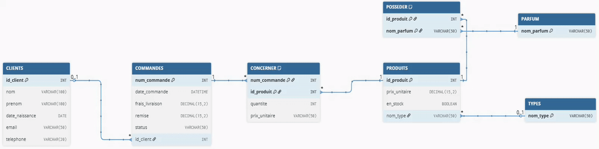

# 🛒 Projet Web de Gestion de Commandes (Usage Personnel)

Ce projet est une application web développée avec **Laravel** pour gérer les commandes passées par mes clients.  
Contrairement à un site e-commerce, l’application est **réservée à un usage interne** : c’est moi qui enregistre les commandes dans le système, et non les clients directement.

---

## 🎯 Objectif du projet

- Centraliser et organiser les informations sur mes **clients**.  
- Gérer un catalogue de **produits** (ex. bougies, fondants) avec leurs types et parfums.  
- Encoder les **commandes** passées par les clients.  
- Suivre l’état de chaque commande (`en attente`, `payée`, `expédiée`, etc.).  
- Conserver l’**historique des produits et des prix** au moment de la commande.  
- Pouvoir appliquer facilement des **remises** (par commande).

---

## 🗂️ Modèle de données

Le schéma inclut les tables principales suivantes :

- **CLIENTS** : informations personnelles des clients  
- **COMMANDES** : informations liées aux commandes 
- **PRODUITS** : catalogue des produits
- **TYPES** : catégories de produits (bougie, fondant, etc.)  
- **PARFUMS** : parfums disponibles pour les produits  
- **CONCERNER** : table de liaison entre les commandes et les produits, qui enregistre pour chaque commande les produits associés, leur quantité et le prix appliqué au moment du passage de la commande (afin de conserver l’historique même si le prix du produit évolue par la suite).
- **POSSEDER** : association entre produits et parfums  

 

---

## ⚙️ Technologies utilisées

- **Laravel 12.31.1** (framework PHP)  
- **SQLite** (base de données légère, fichier unique)
- **Eloquent ORM** (gestion des relations entre entités)  
- **Blade** (moteur de template pour l'interface utilisateur)  

---

## 🚀 Fonctionnalités prévues

- Ajouter / modifier / supprimer des clients  
- Encoder les commandes  
- Ajouter des produits avec leur type, parfum, prix, statut (actif, rupture de stock)  
- Suivre le statut des commandes  
- Appliquer des **remises manuelles** sur une commande ou un produit  
- Calculer automatiquement le **total d’une commande**  
- Accéder à un tableau de bord simple pour visualiser l’activité (commandes, clients, chiffre d’affaires)  

---

## 📌 Remarque

👉 Ce projet est développé **uniquement pour mon usage personnel** afin de simplifier la gestion de mes commandes clients.  
Il n’est **pas destiné à un usage commercial** ni à être utilisé directement par les clients.

---